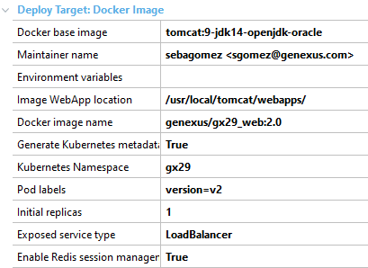
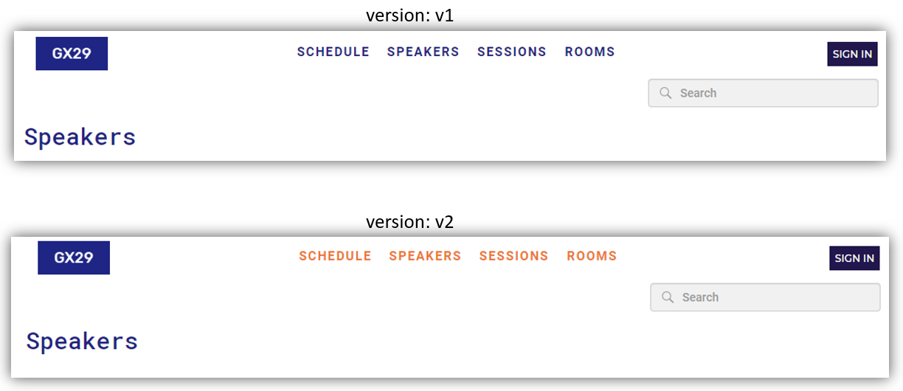

# GeneXus' GX29 app in Kubernetes with Istio

This repo has the needed files to create a Kubernetes cluster of the 29th GeneXus Meeting application, both web app, and mobile backend.
We will also add Istio as the Service Mesh of the cluster.

According to Wikipedia: 
>  a service mesh is a dedicated infrastructure layer for facilitating service-to-service communications between microservices, often using a sidecar proxy. Having such a dedicated communication layer can provide a number of benefits, such as providing observability into communications, providing secure connections, or automating retries and backoff for failed requests.

Some (most) of the files under the [scripts](./scripts/) folder have been generated by GeneXus thanks to its capabilities of Docker Images deployment with Kubernetes integration. The source Knowledge Base can be found at the [
GeneXus Meeting Open Source Project](https://wiki.genexus.com/commwiki/servlet/wiki?4174) page. The DeploymentUnits used were AppGX29-Web and AppsMobile, and they both were deployed to Docker Image enabling Redis session management in a custom namespace and LoadBalancer as the Service type.



These are the basic generated files, I'll let you know about the rest once we get there.

Name|Generated|Description
----|:---:|---
K8s-AppGX29_Web-App.yaml|X|Web app and service of the AppGX29-Web DeploymentUnit
K8s-AppGX29_Web-App-v2.yaml|X|Version 2 of the AppGX29-Web DeploymentUnit 
K8s-Apps_Mobile-App.yaml|X|Web app and service of the AppsMobile DeploymentUnit
K8s-gx29-Redis.yaml|X|Service and Deployment of the Redis container
K8s-gx29-Namespace.yaml|X|Custom namespace definition
K8s-AppGX29_DB.yaml||Service and Deployment of the MySQL database (1)
K8s-AppGX29_Gateway.yaml||Describes load balancing operations
K8s-VirtualService-default.yaml||Configuration affecting traffic routing.

> The database container in this case, and for the sole case of the demo, is in a readonly state. It's not how a tipical application in production would run. 

## Let's begin!

0. Before we start with this demo, you need to have a Kubernetes cluster up & running. Since we're going to use Istio as the Service Mesh, a real cluster is desired. Keep in mind many cloud providers provide a free tier of their Kubernetes solution. Also, you need to have your local `kubectl` tool in the context of the recently created cluster, every cloud provider has a doc page on how to do that. You can take a look at Istio's documentation for many Kubernetes platforms at [Istio Platform Setup](https://istio.io/latest/docs/setup/platform-setup/).

1. Install Istio. You need to have Istio installed in the machine from where you will interact with your cluster, where kubectl is running. I'm using a Windows 10 box running Ubuntu 20 on WSL2.  
Open a terminal and install Instio  
```bash
$ curl -L https://istio.io/downloadIstio | sh -
```
cd into your recently created Istio installation directory and add istioctl to your PATH  
```bash
$ cd istio-1.6.5
$ export PATH=$PWD/bin:$PATH
```
Also, depending on the cluster 

2. Clone this repo and cd into the scripts folder
```bash
$ git clone https://github.com/genexuslabs/gx29-kubernetes-sample.git
$ cd gx29-kubernetes-sample/scripts
```

3. This application will not run on the default namespace. Remember I set `gx29` as the Kubernetes Namespace, so the first thing we need to do is applying the Namespace creation.

```bash
$ kubectl apply -f K8s-gx29-Namespace.yaml
```

4. Now we're going to take Istio to our cluster.
```bash 
$ istioctl install --set profile=demo
```
And we're going to set a label to our previously created Namespace 
```bash
$ kubectl label namespace gx29 istio-injection=enabled
```
This label (istio-injection) tells Istio that every Deployment created in this Namespace should be injected with Istios's sidecars. This injection is what will allow Istio to analize our application and how it communicates with the world, this is what creates the Service Mesh.

5. Now we're ready to start deploying our application. 
```bash
$ kubectl apply -f K8s-AppGX29_DB.yaml
$ kubectl apply -f K8s-gx29-Redis.yaml
$ kubectl apply -f K8s-AppGX29_Web-App.yaml
$ kubectl apply -f K8s-Apps_Mobile-App.yaml
$ kubectl apply -f K8s-VirtualService-default.yaml
$ kubectl apply -f K8s-AppGX29_Gateway.yaml
```
Here's what we've done with these files.  
First, we created the Database container, then the Redis service container, and then both of our applications, the web front-end and the mobile's backend.  
As mentioned before, the gateway is a LoadBalancer and the VisrtualService is where the "magic" happens.

```yaml
...
  - name: "mobile app services"
    match:
    - uri:
        prefix: /rest
    route:
    - destination:
        host: apps-mobile-svc
  - name: "web app"
    route:
    - destination:
        host: appgx29-web-svc

```

This file says "I'll redirect every HTTP traffic I get that has the `/rest` prefix, to the `apps-mobile-svc` host, and everything else goes to `appgx29-web-svc`", which is exactly what we want!.

6. Now is time to see if everything worked as expected. First, we need to know the public IP address of the Gateway. 
```
$ kubectl get svc istio-ingressgateway -n istio-system
```
From what that command returned, you need to copy the `EXTERNAL-IP`.  
Then you can open up your browser and try these urls
```
http://<EXTERNAL-IP>/servlet/com.gx29.website.mainweb
```
This will show you a web page with the speakers of the GX29 meeting.

```
http://<EXTERNAL-IP>/rest/Mobile/SpeakersWidget_Level_Detail_GridSpeakers
```
While this one will show you a JSON with every speaker because this service is consumed by the mobile app. By the way, if you want to test the mobile app against these services, all you need to do is set the IP part of your services in GeneXus' [Services URL property](https://wiki.genexus.com/commwiki/servlet/wiki?21146) (http://\<EXTERNAL-IP>).

## Service Mesh features

Here are a small list and samples of features you can easily accomplish with Istio.

### Traffic Management

We showed already how to handle Traffic Management with our [VirtualService](./scripts/K8s-VirtualService-default.yaml) file.

In that case, we wanted to redirect traffic depending on where is it heading. Is it a request to our HTML interface or our rest interface?
But traffic management is also a good way of implementing different types of deployments like Canary or Blue/Green.

To show this, take a look at the advanced folder under scripts.
There's a file called [K8s-AppGX29_Web-App-v2.yaml](./scripts/advanced/K8s-AppGX29_Web-App-v2.yaml) which contains a reference to a newer version of the Web (HTML) app. It also has a label called version with value v2.

If you apply this file to the cluster the new deployment will be up and running.

Also, there's another file that creates a new object in the cluster called DestinationRule. This file, called [K8s-DestinationRule.yaml](./scripts/advanced/K8s-DestinationRule.yaml), holds the YAML that tells the cluster "this service (appgx29-web-svc) has two `subsets`. One is called v1, and matches to the one with the label version set to v1, and the other one is called v2 and corresponds to the one with the label version set to v2. 

```yaml
...
  host: appgx29-web-svc
  subsets:
  - name: v1
    labels:
      version: v1
  - name: v2
    labels:
      version: v2
```

Once we have this in place, we can apply a new VirtualService, like the one in the file [K8s-VirtualService-percent.yaml](./scripts/advanced/K8s-VirtualService-percent.yaml) which sets weights for the inbound traffic, and in this particular case, it states "from all the traffic that comes inbound to the HTML app, send 75% of it to the previous (v1) version, and 25% to the new (v2) version.

```yaml
...
  - name: "web app"
    route:
    - destination:
        host: appgx29-web-svc
        subset: v1
      weight: 75
    - destination:
        host: appgx29-web-svc
        subset: v2
      weight: 25
```

If you know try to access the HTML app, one out of four times will be viewing the v2 version. You'll notice it because v2 has a different color (orangeish) in the top menu buttons.



### Observability

Because of the profile of Istio we installed, our Service Mesh already has a lot of tools to help us analyze and see how our application and the traffic is moving between components.

That's for instance the case of Prometheus, Kiali and Grafana.

Let's fire up Kiali
```
$ istioctl dashboard kiali
```

The output of that command will tell you the url to open up in your browser. Since we installed the demo profile, a user called `admin` with also `admin` as the password has been created for us.

Log in and explore what Kali has to offer and how you can see your app working.


You can also fire up Grafana
```
$ kubectl -n istio-system port-forward $(kubectl -n istio-system get pod -l app=grafana -o jsonpath='{.items[0].metadata.name}') 3000:3000 &
```

And visit http://localhost:3000/dashboard/db/istio-mesh-dashboard in your browser.

Again, a whole lot in information about how every component in your cluster in behaving


For more information about Observability with Istio take a look [here](https://istio.io/latest/docs/tasks/observability/)

### Circuit Breaking

Together with [Retry](https://docs.microsoft.com/en-us/azure/architecture/patterns/retry), [Circuit Breaker](https://docs.microsoft.com/en-us/azure/architecture/patterns/circuit-breaker) is one of the most popular patterns that must be implemented when moving to a Cloud infrastructure.

Istio comes with a way of easily implement Circuit Breaker without the need of modifying our application.

If you take a look at the file [K8s-DestinationRule-CircuitBreaker.yaml](./scripts/advanced/K8s-DestinationRule-CircuitBreaker.yaml) you will see that a sample of Circuit Breaker has been added just for testing purposes.

```yaml
...
spec:
  host: appgx29-web-svc
  trafficPolicy:
    connectionPool:
      tcp:
        maxConnections: 100
      http:
        http1MaxPendingRequests: 1000
        maxRequestsPerConnection: 10
    outlierDetection:
      consecutiveErrors: 5
      interval: 5m
      baseEjectionTime: 15m
      maxEjectionPercent: 100
```

Take a look at Istio's [OutlierDetection](https://istio.io/latest/docs/reference/config/networking/destination-rule/#OutlierDetection) for more info. 

### and more!

There are many ways in which you can enhance you application running in a Kubernetes cluster with Istio. You can provide [mirroring](https://istio.io/latest/docs/tasks/traffic-management/mirroring/) for testing purposes, or [fault injection](https://istio.io/latest/docs/tasks/traffic-management/fault-injection/) or implement [request timeouts](https://istio.io/latest/docs/tasks/traffic-management/request-timeouts/). 

If you didn't already know, you probably realized by now that Istio is a ver powerful Service Meshe implementation, and allows you to perform tasks that otherwise you should implement yourself in your application, wasting time and allowing bugs to show up. By using a Service Mesh implementation with a GeneXus application you only have to care for what matters the most, your business logic.  
